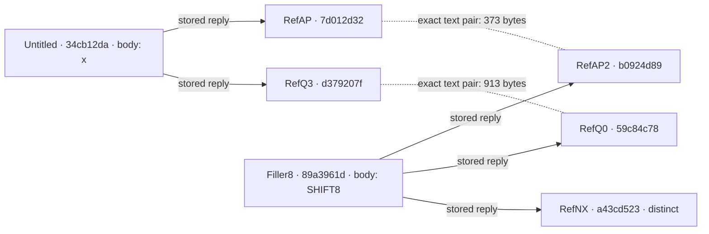

# Bounty #33 — repeated paste branches, partial evidence

Two paste branches contain the same USAspending API block and the same SF133 report-link block. Current provider pages explicitly identify five parent/reply relations, reciprocated by the parents' reply tables. This supports stored structure and exact text reuse. **It does not identify a dated template, copying direction, task execution, actor or semantic conversation. Keep #33 open.**

The seven source pages were captured on 5 September 2026, between 18:45:34.753419Z and 18:49:03.625254Z. Each page displayed only the relative age “3 Months ago.” That text is not converted into a publication timestamp. These are current captures made after public disclosure of the wider investigation.



Solid arrows point from a provider-declared parent to its listed reply. Dotted lines annotate byte equality of decoded paste text; they imply no chronology or communication. The filler bodies `x` and `SHIFT8` have no task URLs. RefNX is a separate three-link sibling, not a third exact pair.

| Paste | Source | Retained record before this acquisition | Current decoded body |
| --- | --- | --- | --- |
| Untitled | [34cb12da](https://paste.linuxiarz.pl/view/34cb12da) | Absent from full and focused corpus | `x`, 1 byte |
| Filler8 | [89a3961d](https://paste.linuxiarz.pl/view/89a3961d) | Full: `caf81e6954db5f753aa7ef8533c49d81`; absent focused | `SHIFT8`, 6 bytes |
| RefAP | [7d012d32](https://paste.linuxiarz.pl/view/7d012d32) | `5f4adaa5c03919ca55231fad7800bfcc` | Four API links, 373 bytes |
| RefAP2 | [b0924d89](https://paste.linuxiarz.pl/view/b0924d89) | `be8776ed5c8b92e805c040b19372b39e` | Exact RefAP pair |
| RefQ3 | [d379207f](https://paste.linuxiarz.pl/view/d379207f) | `0d58fae455d31c70235a33212f25d566` | Seven SF133 links, 913 bytes |
| RefQ0 | [59c84c78](https://paste.linuxiarz.pl/view/59c84c78) | `d4f4dd52b4f7b87470b56384561e58a0` | Exact RefQ3 pair |
| RefNX | [a43cd523](https://paste.linuxiarz.pl/view/a43cd523) | `10b5ccacfb53f38353fb92582b8a7180` | Three distinct spreadsheet/ZIP links, 478 bytes |

The five child bodies already existed in both corpus scopes. The two parent pages received new current captures; **only the `x` parent was absent from the full acquisition corpus**. Filler8/SHIFT8 already existed in the full corpus and had been excluded from the focused snapshot. “Absent” here is a recorded exact source-URL lookup among `paste_body` records in the frozen databases before these acquisitions, not a claim that the page or text was globally unknown.

## Exact packets

The API pair preserves this order: `ACCGET` account `075-8005`; `ACCGET23` the same account with `fiscal_year=2023`; `SNAP23` path `federal_accounts/5599/fiscal_year_snapshot/2023/`; `QEND` path `api/v1/tas/balances/quarters/total/` without a query. The exact text SHA-256 is `5cf58fbb41910d29c900b8a7bd920670d86d0399e03f60e4e07db929dd871a27`.

The SF133 pair preserves seven labels in order: `Q2MDSCHEMELESS`, `Q3MDSCHEMELESS`, `Q2DIRECT`, `Q3DIRECT`, `Q2MDFULL`, `Q2CORS`, `Q2AO`. It names MAX attachment parent `2346466575` and PDF files `2374423602.pdf` and `2398882076.pdf`, retaining all literal wrapper differences. Its text SHA-256 is `1d118617bd67c287e69b813660b9b586debddafeb7570e8162b31918131eabe5`.

Complete factual paste text is retained in `evidence/bodies/`; exact URL/label arrays are in `evidence/pastes.json`. HTML entities are decoded once from `textarea#code`, with no percent-decoding, URL normalization, sorting or deduplication. RefNX's `embedded=1%26url=...` stays encoded inside its literal URL. Link labels such as Q2/Q3/2023 describe the pasted strings; this package has not retrieved or validated the government responses, reporting periods or account relationships those strings appear to request.

## Offline verification

Run from the extracted package with Python 3.9 or later:

```sh
python3 verify.py --negative-controls
```

The verifier reads only this package and writes nothing. It checks 11 evidence-file hashes, 16 exact HTML excerpts, seven decoded body hashes, the two complete text pairs, both filler controls and five reciprocal native relations. It also checks exact account/year/attachment identifiers, label and URL order, nested URL representation, and the distinction between full and focused corpus declarations.

Ten synthetic, in-memory negative controls reject altered bytes, a swapped parent, an altered reciprocal reply row, wrong account/attachment IDs, reordered URLs, a different ordinary-document account/year example, a filler promoted into a task packet, RefNX falsely paired, and an encoded delimiter rewritten. The ordinary-document control substitutes account `2357` and year `2015`; it checks exact-packet discrimination, not the contents or age of any omitted documentation page.

## Provenance and what remains unverified

`evidence/captures.json` records the seven exact source URLs, acquisition clocks, observed HTTP status, whole-capture byte counts and SHA-256 values. Entire site HTML and raw HTTP headers are omitted. `evidence/excerpts.json` retains only exact contiguous source excerpts: the paste textareas, five parent assertions, two reply-section headings and two reply tables. Every excerpt records its own hash and zero-based byte range in its original whole capture. These ranges and whole hashes were checked against the original captures at packaging and independently reviewed.

**The standalone verifier cannot recompute an omitted whole-HTML hash, independently establish that an excerpt occupied its declared position in that omitted file, reconstruct omitted section context, or re-run an absent full-corpus search.** It checks the included excerpts, their integrity, range consistency and the claims directly supported by their text. Whole-capture hashes and corpus record IDs remain provenance anchors. `evidence/claims.json` states this scope explicitly. Current sources may change; an independent re-acquisition should preserve raw GET response bytes and acquisition metadata before extracting, then compare the resulting whole-file hashes and exact source fragments. Do not submit forms or fetch the nested payload URLs.

No independently dated source/template outside these retained copies was recovered. The unresolved question is what source or template explains both repeated blocks and the paired branch construction. A new dated source would need the exact ordered strings or an explicit connection among the distinctive IDs, plus evidence separating publication, revision, archive, request and acquisition clocks. Equality, writer labels, relative ages and native links do not establish origin or propagation direction. This package is a partial evidence update and does not satisfy that missing requirement for closing #33.

## Source attribution and minimal quotation

Source: the seven linked pages at paste.linuxiarz.pl. Included material consists of factual paste strings/URLs and short functional HTML excerpts needed to inspect the provider's structural assertions. The surrounding site template, scripts, forms, images and raw headers are not redistributed. No blanket license for the original website is asserted. Names appearing inside an exact provider excerpt are unverified display labels, not resolved identities.
